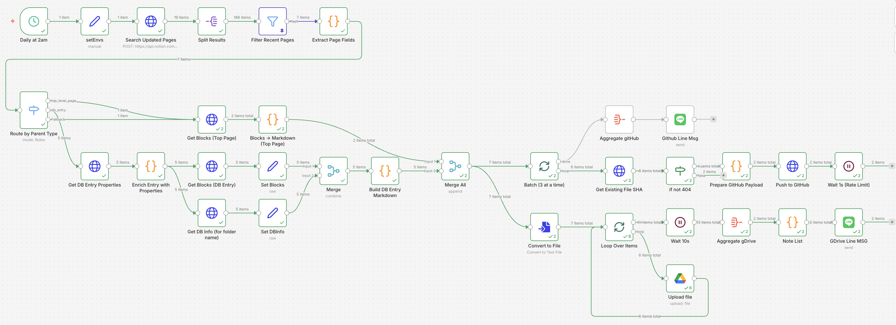

# Notion Backup
## Goal 
- Search for updated pages within N days
- Backup page files to Google Drive and GitHub
- Send Line notification on completion

## WorkLog
### v1
- search for databases to get structure
- output csv to google drive
- search for updated pages for browser automation
- playwright failed to load in docker n8n env.

### v2
- set up docker env to pass on credentials and n8n global vars to refereneced throughout the workflow.
- tried out browser-use cloud service with provided credentials. pages loaded and downloaded correctly.
- tried to use local version of browser-use, no luck

### v3
- search for updated pages
- find parent nodes
- dedupe parent nodes
- output links to google sheets for further operation

### v4 (gDrive + GitHub + Line)
- search for updated pages → split, filter, extract page fields
- route by parent type (top-level page vs DB entry)
  - **top-level page**: get blocks → convert to markdown
  - **DB entry**: get entry properties → get blocks → get DB info (for folder name) → build markdown
- merge all results → batch (3 at a time)
- **GitHub branch**: get existing file SHA → prepare payload → push to GitHub → rate limit wait → aggregate → GitHub Line notification
- **Google Drive branch**: convert to file → loop & upload to Google Drive → aggregate → note list → gDrive Line notification
- ⚠️ Line notification to be completed

## Lesson Learned
- google service accounts don't have access to google drive, need to use google oauth2
- google drive and google sheet are different APIs in GCP.
- for gcp oauth2 audience needs to be external. apps needs to be verified to be published. luckily it's not needed for n8n usage in my case.
- n8n dedupe: tried to use a global var to hold object, but n8n nodes return object for an array.
- notion url: remove '-' in page id for page uri
- browser-use cloud service could help with browser automation with provided login credentials, but it needs subscription
- browser-use local version: it's easier to set up with docker. otherwise may encounter various env, package, dependency issue.
